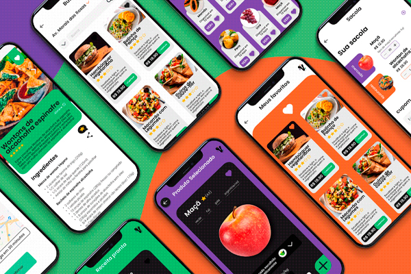

<div align="center">
  

  # 🥗 Veegan
  **Seu delivery de comida saudável, prático e vibrante!**

  [](https://opensource.org/licenses/MIT)
  [](#)
  [](#)
</div>

## 📖 Sobre o Projeto

O **Veegan** é um aplicativo focado na alimentação de pessoas veganas e vegetarianas, ou simpatizantes, com opções de mercado, delivery ou preparo de receitas. O projeto nasceu para facilitar o acesso a uma alimentação plant-based de forma colorida, intuitiva e descomplicada.

A interface foi desenhada para ser **vibrante e moderna**, utilizando uma paleta de cores forte (Laranja Energético, Roxo Criativo e Verde Fresh) que remete à diversidade dos ingredientes naturais.

---

## 🚀 Funcionalidades

- 🍎 **Mercado:** Seleção de produtos frescos e especializados para o público vegano/vegetariano.
- 🛵 **Delivery:** Pedidos de restaurantes parceiros com entrega rápida.
- 📖 **Receitas Prontas:** Passo a passo detalhado com lista de ingredientes para quem prefere cozinhar em casa.
- ❤️ **Favoritos:** Salve suas comidas e receitas preferidas para acesso rápido.
- 🛒 **Sacola Inteligente:** Gerenciamento de itens do mercado e do restaurante em um só lugar.

---

## 🛠 Tecnologias Utilizadas

Este projeto foi construído utilizando as seguintes tecnologias:

- [HTML5](https://developer.mozilla.org/pt-BR/docs/Web/HTML) - Estruturação dos elementos.
- [CSS3](https://developer.mozilla.org/pt-BR/docs/Web/CSS) - Estilização, Flexbox e Grid (incluindo efeitos de Glassmorphism e Hover).
- [Git](https://git-scm.com/) - Controle de versão.
- [GitHub](https://github.com/) - Hospedagem do repositório.

---

## 📱 Interface do Usuário

<div align="center">
  
  <p><em>Exemplos de telas: Receitas, Favoritos, Sacola e Detalhes do Produto.</em></p>
</div>

---

## ⚙️ Como executar o projeto

Para visualizar o projeto localmente, siga estes passos:

1. Clone o repositório:
   ```bash
   git clone [https://github.com/seu-usuario/seu-repositorio.git](https://github.com/seu-usuario/seu-repositorio.git)